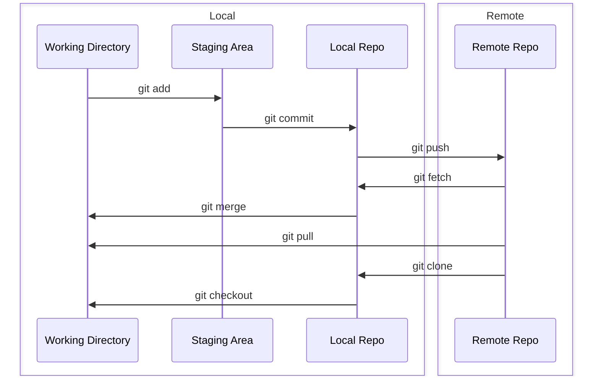

:::info
Working directory: where we edit files

Staging area: a temporary location where files are kept for the next commit

Local repository: contains the code that has been committed

Remote repository: the remote server that stores the code (github, gitlab, bitbucket)
:::
